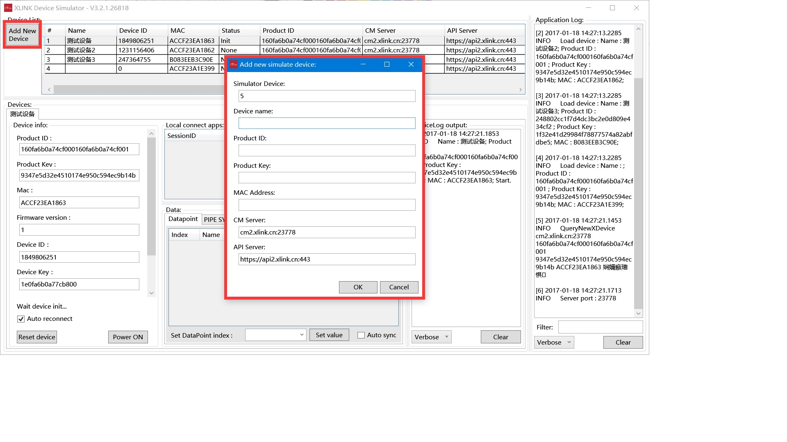

title: 云平台入门
---

你可以通过硬件模拟器来快速了解云智易平台的数据通信。
#### 环境准备
应用平台：WinXP、win7、Win8、Win10基于企业在管理后台维护的产品信息、设备信息和数据端点信息，真实有效模拟智能硬件设备的各个数据通讯过程和数据交互。
### 1、注册xlink帐号
首先，你需要在[云智易官网](http://www.xlink.cn/) 注册xlink帐号。
- 打开云智易开发者网站：http://www.xlink.cn
- 点击免费注册按钮
- 输入注册信息进行注册
- 输入注册的账号，登录企业管理后台，在右上角账号信息中可以查看企业ID，此ID在后续步骤中需要使用。
### 2、创建产品
注册xlink帐号之后，你需要登录平台，进入开发者平台。
* 添加产品，填写产品信息（包括：产品名称、产品型号、产品类型、连接类型、产品描述）
* 完成产品创建
### 3、获得产品ID和密钥，添加产品数据端点
* 产品添加完成后，可获得产品ID、产品密钥
* 添加产品数据端点
在产品调试之前需要给产品添加数据端点，用以获取以及调试产品状态。
#### 数据端点是什么？
数据端点是对设备运行状态的某种特征值或者某种动作的抽象。 例如对于灯设备，特征值:灯的亮度，动作:灯的开或关。
#### 数据端点能做什么事情
数据端点是平台与设备进行交互的基础/核心/桥梁，相当于沟通协议。

* 控制设备。 以灯设备为例, 灯拥有者通过向平台发送代表开灯指令，平台向设备发送要设置“开关”数据端点值，设备接收到平台发送值进行解析从而执行操作，诸如此类还有控制灯的亮度等等。

* 记录设备当前运行状态--虚拟设备。 设备每上报一次数据端点，都会映射成虚拟设备的一个特征值，用户可以通过请求虚拟设备信息来知道设备当前所处运行状态。

* 记录设备历史运行状态--快照。 设备运行状态的记录通过向平台上报数据端点值, 平台接收到上报数据端点值后会依据快照规则将其记录起来, 此为设备快照, 针对快照，即可查询设备所有的运行记录。

* 设备运行状态分析--统计。 基于快照保存的设备运行状态即是设备数据端点值，平台会依照统计规则进行设备行为分析。 以太阳能设备为例，可以统计分析出太阳能每天产生能量峰值，总值等等。

* 设备状态监控--告警通知。 设备上报运行状态，依照告警通知规则，进行触发告警。 以灯设备为例，假如设备上报灯的亮度数据端点值为百分之八十，而告警规则设置其阈值为百分之七十，此时会通过不同的渠道通知灯设备拥有者(邮件/收集状态栏推送等)。
#### 数据端点的限制
* 支持类型:布尔类型, 单字节, 短整型, 整型, 浮点型, 字符串, 字节数组, 16位整型无符号, 32位整型无符号

* 个数限制:200

* 公共数据端点:所有设备在xlink平台都应该具有的数据端点
### 4、添加设备
产品添加数据端点后，在产品类型下设备调试模块添加设备，输入设备MAC地址（12位字符串地址）以及序列号，设备名称等信息，完成设备添加。
### 5、下载硬件模拟器
[XLINK设备模拟器](https://github.com/xlink-corp/xlink-sdk/tree/master/%E7%A1%AC%E4%BB%B6%E6%A8%A1%E6%8B%9F%E5%99%A8_v3/win32)是一个Windows应用程序，用来模拟XLINK设备的通讯功能，特别是验证与测试XLINK设备通讯协议，包括局域网内的通讯协议和云端的通讯协议。
#### 设备模拟器运行环境
* XLINK模拟器采用微软.Net 4.0框架开发；需要依赖于微软.Net 4.0运行环境；
   Net 4.0 framework下载地址: https://www.microsoft.com/zh-CN/download/details.aspx?id=17718   
* XLINK模拟器在Windows Vista以上运行良好，不建议使用在Windows XP上使用；不支持Windows XP以下系统；
* XLINK模拟器支持32位Windows环境和64位Windows环境；
### 6、模拟设备激活上线，设备与云平台数据通讯
* 启动硬件模拟器，添加设备，输入设备信息

* 添加设备后，点击设备右击启动设备，可查看平台设置的设备数据端点数据

* 模拟设备与云平台数据通讯
设备模拟器上线后，云平台可查看设备在线状态，更改设备数据端点

修改设备模拟器数据端点

云平台同步接收设备模拟器数据

